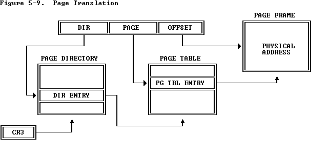
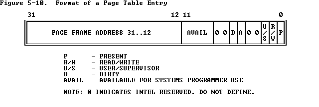

## Lab 2: Memory Management

### Part 1: Physical Page Management

Before configuring the paging system with mem_init, we note that the virtual memory subsystem has already been configured in entry.S using the following code:

```x86asm
# Load the physical address of entry_pgdir into cr3.  entry_pgdir
# is defined in entrypgdir.c.
movl    $(RELOC(entry_pgdir)), %eax
movl    %eax, %cr3
# Turn on paging.
movl    %cr0, %eax
orl     $(CR0_PE|CR0_PG|CR0_WP), %eax
movl    %eax, %cr0
```

entry_pgdir (the page directory) is defined as:

```c
__attribute__((__aligned__(PGSIZE)))
pde_t entry_pgdir[NPDENTRIES] = {
        // Map VA's [0, 4MB) to PA's [0, 4MB)
        [0] = ((uintptr_t)entry_pgtable - KERNBASE) + PTE_P,
        // Map VA's [KERNBASE, KERNBASE+4MB) to PA's [0, 4MB)
        [KERNBASE>>PDXSHIFT] = ((uintptr_t)entry_pgtable - KERNBASE) + PTE_P + PTE_W
};
```

we notice that the current high virtual addresses are from `0xf0000000 to 0xf03fffff` and from `0x00000000 to 0x003fffff`. we can confirm the upper limit `0xf03fffff` in gdb:

```gdb
(gdb) x/1b 0xf0400000
0xf0400000:     Cannot access memory at address 0xf0400000
(gdb) x/1b 0xf0400000-1
0xf03fffff:     0x00
```

[Summary of how the memory management works in lab 2](https://github.com/Babtsov/jos/tree/master/lab2#summary-of-how-the-memory-management-works-in-lab-2). Here is the summarize:

The JOS kernel starts with `entry_pgdir` mapping the first 4 MB of physical RAM into the virtual range `0xf0000000–0xf03fffff`, giving it a usable region that overlaps the kernel’s linked address space. Since no general-purpose allocator exists yet, the kernel introduces `boot_alloc`, a simple temporary allocator confined to this 4 MB region, which ensures allocations are page-aligned so that structures like the new page directory kern_pgdir can be created. Using `boot_alloc`, JOS allocates an array of `PageInfo` structs—one for each physical page frame in the system—to record allocation status and metadata, and organizes them into a linked list called `page_free_list`. Initially, only page frames in the first 4 MB are usable because higher memory has not yet been mapped, but once the kernel builds and installs `kern_pgdir`, it expands the virtual mapping so that all of physical RAM up to `0x0fffffff` is accessible in the region `0xf0000000–0xffffffff`. This requires page tables to cover about 64K frames (268 MB worth), which fits comfortably in memory overhead (~256 KB), and once `kern_pgdir` is loaded into the `cr3` register, the kernel has a complete memory management setup where `page_alloc` can draw from `page_free_list`, `page2kva` can translate page frames into kernel virtual addresses, and dynamic allocation is possible beyond the bootstrapping phase.

<details>
<summary><strong>Exercise 1</strong></summary>

> In the file kern/pmap.c, you must implement code for the following functions (probably in the order given).

> boot_alloc()
> mem_init() (only up to the call to check_page_free_list(1))
> page_init()
> page_alloc()
> page_free()

> check_page_free_list() and check_page_alloc() test your physical page allocator. You should boot JOS and see whether check_page_alloc() reports success. Fix your code so that it passes. You may find it helpful to add your own assert()s to verify that your assumptions are correct.

About the [external linker symbol](https://github.com/Babtsov/jos/tree/master/lab2#external-linker-symbol)

Implement function

- `boot_alloc(uint32_t n)`: A simple physical memory allocator used during initialization. It returns a pointer to `n` bytes of contiguous physical memory. If `n` is 0, it returns the next free page without allocating anything. The function ensures that the returned memory is page-aligned.

    ```c
    static void *
    boot_alloc(uint32_t n)
    {
        static char *nextfree;	// virtual address of next byte of free memory
        char *result;

        // Initialize nextfree if this is the first time.
        // 'end' is a magic symbol automatically generated by the linker,
        // which points to the end of the kernel's bss segment:
        // the first virtual address that the linker did *not* assign
        // to any kernel code or global variables.
        if (!nextfree) {
            extern char end[];
            nextfree = ROUNDUP((char *) end, PGSIZE);
        }

        // Allocate a chunk large enough to hold 'n' bytes, then update
        // nextfree.  Make sure nextfree is kept aligned
        // to a multiple of PGSIZE.
        //
        // LAB 2: Your code here.

        result = nextfree;
        if (n > 0)
        {
            nextfree = ROUNDUP(nextfree + n, PGSIZE);
            if (((uint32_t)nextfree - KERNBASE) > (npages * PGSIZE))
            {
                panic("boot_alloc: out of memory. Requested %uK, available %uK.\n", (uint32_t)nextfree / 1024, npages * PGSIZE / 1024);
            }
        }
        return result;
    }
    ```

- `page_init()`:

```c
void
page_init(void)
{
	// The example code here marks all physical pages as free.
	// However this is not truly the case.  What memory is free?
	//  1) Mark physical page 0 as in use.
	//     This way we preserve the real-mode IDT and BIOS structures
	//     in case we ever need them.  (Currently we don't, but...)
	//  2) The rest of base memory, [PGSIZE, npages_basemem * PGSIZE)
	//     is free.
	//  3) Then comes the IO hole [IOPHYSMEM, EXTPHYSMEM), which must
	//     never be allocated.
	//  4) Then extended memory [EXTPHYSMEM, ...).
	//     Some of it is in use, some is free. Where is the kernel
	//     in physical memory?  Which pages are already in use for
	//     page tables and other data structures?
	//
	// Change the code to reflect this.
	// NB: DO NOT actually touch the physical memory corresponding to
	// free pages!
    size_t i;

    //  1) Mark physical page 0 as in use.
    //     This way we preserve the real-mode IDT and BIOS structures
    //     in case we ever need them.  (Currently we don't, but...)
    pages[0].pp_ref = 1;
    pages[0].pp_link = NULL;

    //  2) The rest of base memory, [PGSIZE, npages_basemem * PGSIZE)
    //     is free.
    for (int i = 1; i < npages_basemem; i++)
    {
        pages[i].pp_ref = 0;
        pages[i].pp_link = page_free_list;
        page_free_list = &pages[i];
    }

    //  3) Then comes the IO hole [IOPHYSMEM, EXTPHYSMEM), which must
    //     never be allocated.
    uint32_t first_free_pa = (uint32_t)PADDR(boot_alloc(0));
    assert(first_free_pa % PGSIZE == 0);
    int free_pa_pg_indx = first_free_pa / PGSIZE;
    for (int i = npages_basemem; i < free_pa_pg_indx; i++)
    {
        pages[i].pp_ref = 1;
        pages[i].pp_link = NULL;
    }

    //  4) Then extended memory [EXTPHYSMEM, ...).
    //     Some of it is in use, some is free. Where is the kernel
    //     in physical memory?  Which pages are already in use for
    //     page tables and other data structures?
    for (int i = free_pa_pg_indx; i < npages; i++)
    {
        pages[i].pp_ref = 0;
        pages[i].pp_link = page_free_list;
        page_free_list = &pages[i];
    }
```

- `mem_init()`:

```c
	// Allocate an array of npages 'struct PageInfo's and store it in 'pages'.
	// The kernel uses this array to keep track of physical pages: for
	// each physical page, there is a corresponding struct PageInfo in this
	// array.  'npages' is the number of physical pages in memory.  Use memset
	// to initialize all fields of each struct PageInfo to 0.
	// Your code goes here:

    pages = (struct PageInfo *) boot_alloc(npages * sizeof(struct PageInfo));
    memset(pages, 0, npages * sizeof(struct PageInfo));
```

- `page_alloc(int alloc_flags)`:

```c
struct PageInfo *
page_alloc(int alloc_flags)
{
	// Fill this function in
    struct PageInfo *pp;

    if (page_free_list == NULL)
    {
        return NULL;
    }

    pp = page_free_list; // Point to the first free page
    page_free_list = page_free_list->pp_link; // Update the free list to point to the next free page
    pp->pp_link = NULL; // Set the pp_link field of the allocated page to NULL

    if (alloc_flags & ALLOC_ZERO)
    {
        memset(page2kva(pp), 0, PGSIZE);
    }

    return pp;
}
```

- `page_free(struct PageInfo *pp)`:

```c
void
page_free(struct PageInfo *pp)
{
	// Fill this function in
	// Hint: You may want to panic if pp->pp_ref is nonzero or
	// pp->pp_link is not NULL.

    if (pp->pp_ref != 0 || pp->pp_link != NULL)
    {
        panic("page_free: invalid page free attempt.\n");
    }

    pp->pp_link = page_free_list;
    page_free_list = pp;
}
```

Detail explain for all implemented functions can be found in [here](https://github.com/Babtsov/jos/tree/master/lab2#implementing-boot_alloc)

</details>

### Part 2: Virtual Memory

<details>
<summary><strong>Exercise 2</strong></summary>

This is the summarize for the content of [5.2 Page Translation](https://pdos.csail.mit.edu/6.828/2018/readings/i386/s05_02.htm) and [6.4 Page-Level Protection](https://pdos.csail.mit.edu/6.828/2017/readings/i386/s06_04.htm)

#### Section 5.2 – Page Translation

**Overview:** This section focuses on the second phase of address translation in the 80386: converting a linear address to a physical address via paging.

**Key Concepts:**
1. Enabling Page Translation: Page translation only occurs if the PG bit in control register CR0 is set by the operating system—necessary for virtual memory and paging-based protection.
2. Page Frames and Linear Addresses:
- Page Frame: A 4 KB contiguous block in physical memory.
- Linear Address: Divided into three parts—DIR, PAGE, and OFFSET—which are used to index into a page directory and table, then locate the specific byte within the page.
3. Two-Level Page Tables: The system uses two levels: a page directory and second-level page tables. Each can hold up to 1K entries; combined, they can map the entire 4 GB physical memory space (2^20 pages × 2^12 bytes per page = 2^32).
4. CR3 Register (Page Directory Base Register): CR3 holds the physical address of the current page directory. Operating systems may choose to use a single page directory for all tasks or separate ones per task.
5. Page-Table Entry Format:

- Page Frame Address: Physical base address of the page or page table (lower 12 bits are zero due to 4 KB alignment).

- Present (P) Bit: Indicates whether the entry is valid. If P=0, using that entry causes a page-fault exception—OS can then map the page and retry.

- Accessed and Dirty Bits:

    - Accessed: Set on any access (read or write).

    - Dirty: Set on write (only in PTEs; directory entry dirty bit undefined).

    - OS uses these to decide which pages to evict.

- R/W and U/S Bits: Control read/write permission and user/supervisor access—ties back to page-level protection.

6. Page-Translation Cache (TLB):
- The CPU caches recent page table entries in a translation lookaside buffer for faster access.
- The cache must be flushed when page tables change:

    - By reloading `CR3` - `MOV CR3, EAX`.
    - By performing a task switch to a different TSS with a different CR3.

#### Section 6.4 – Page-Level Protection

**Overview:** This section explains how the 80386 CPU handles page-level protection using fields in both Page Directory Entries (PDEs) and Page Table Entries (PTEs).
**Key Concepts:**
1. Restricting the Addressable Domain:
- Privilege Levels: Pages are tagged as supervisor (U/S = 0) or user (U/S = 1).
- Current Privilege Level (CPL): If CPL is 0, 1, or 2, the CPU is in supervisor mode and can access all pages. If CPL is 3 (user mode), the CPU can only access pages marked as user level

2. Type Checking:
- Pages also have a Read/Write bit (R/W): R/W = 0 for read-only, R/W = 1 for read/write.
- Supervisor mode can read and write any page. In user mode, only pages marked as user-level and read/write are writable; supervisor-level pages are inaccessible.

3. Effective Protection: Combining PDE (Page Directory Entry)and PTE (Page Table Entry):
- Protection attributes in the PDE and PTE may differ.
- The CPU combines both to determine the actual access rights for any given page. A table (not shown here) illustrates all possible combinations

4. Overrides to Page Protection: Some accesses are treated as if they're coming from supervisor mode (CPL 0), even if the CPU is in user mode (CPL 3). These include:

- References to special structures like the LDT, GDT, TSS, or IDT.
- Accesses during ring-crossing to the inner stack triggered by instructions such as CALL or INT.

</details>

<details>
<summary><strong>Exercise 3</strong></summary>

Assuming that the following JOS kernel code is correct, what type should variable x have, uintptr_t or physaddr_t?
```c
	mystery_t x;
	char* value = return_a_pointer();
	*value = 10;
	x = (mystery_t) value;
```

The variable `x` should have the type `uintptr_t`. Since `value` is a pointer to a character, it represents a virtual address in the kernel's address space. When we cast `value` to `mystery_t`, we are converting a virtual address to an integer type that can hold the address value. The `uintptr_t` type is specifically designed for this purpose, as it is an unsigned integer type capable of holding a pointer.

</details>

For short, x86 processors use a 2-level page table shown below:



And the format of DIR ENTRY and PG TBL ENTRY is illustrated in the figure below:



The JOS kernel sometimes only knows a physical address (e.g., when allocating or initializing page tables), but since the CPU always uses virtual memory, it cannot directly read/write that physical location. To solve this, JOS maps all of physical memory into the virtual region starting at 0xf0000000, so the kernel can translate a `physical → virtual` address by adding `0xf0000000` `(KADDR(pa))`, and translate a virtual → physical address by subtracting 0xf0000000 `(PADDR(va))`. Because both page tables and pages are located on 4K boundaries, the lower 12 bits of their address is always zero. The PTE only needs 20 bits to indicate the starting physical address.

<details>
<summary><strong>Exercise 4</strong></summary>

> In the file kern/pmap.c, you must implement code for the following functions.

>        pgdir_walk()
>        boot_map_region()
>        page_lookup()
>        page_remove()
>        page_insert()

> check_page(), called from mem_init(), tests your page table management routines. You should make sure it reports success before proceeding.

First for the `pgdir_walk(pde_t *pgdir, const void *va, int create)` function. This function return a pointer to the page table entry (PTE) for the given virtual address `va`. If the page table for that address does not exist and `create` is true, it should allocate a new page table. If allocation fails, it should return NULL. If `create` is false and the page table does not exist, it should also return NULL. Below is a possible implementation of this function (I commented the code for clarity):

```c
pte_t *
pgdir_walk(pde_t *pgdir, const void *va, int create)
{
    uintptr_t addr = (uintptr_t)va; // Convert the virtual address to an integer
    pde_t pde = pgdir[PDX(addr)]; // Get the page directory entry for the virtual address

    // Check if the page directory entry is present
    // If not, and if create is true, allocate a new page table
    if (!(pde & PTE_P) && create)
    {
        struct PageInfo *pd_page = page_alloc(ALLOC_ZERO); // Allocate a new page for the page table
        if (!pd_page)
        {
            return NULL;
        }
        pd_page->pp_ref++; // Increment the reference count for the new page table
        pde = page2pa(pd_page) | PTE_W | PTE_P | PTE_U; // Set permissions
        pgdir[PDX(addr)] = pde; // Update the page directory entry
    } else if (!(pde & PTE_P))
    {
        return NULL;
    }

    physaddr_t pgtable_pa = PTE_ADDR(pde); // Get the physical address of the page table entry
    pde_t *pgtable_va = KADDR(pgtable_pa); // Convert the physical address to a kernel virtual address
    return &pgtable_va[PTX(addr)]; // Return a pointer to the page table entry
}
```

Note that the function `page_alloc(int alloc_flags)` always give us a page with a reference count of 0, so we need to increment the reference count after allocation. The `ALLOC_ZERO` flag is used to ensure that the newly allocated page is zeroed out.

Next for the `boot_map_region(pde_t *pgdir, uintptr_t va, size_t size, physaddr_t pa, int perm)` function. This function maps a region of virtual addresses to a region of physical addresses in the page table. The `va` parameter is the starting virtual address, `size` is the size of the region to map, `pa` is the starting physical address, and `perm` are the permissions for the mapping. Below is a possible implementation of this function:

```c
static void
boot_map_region(pde_t *pgdir, uintptr_t va, size_t size, physaddr_t pa, int perm)
{

    asset(size % PGSIZE == 0);
    asset(va % PGSIZE == 0);
    asset(pa % PGSIZE == 0);

    for (int i = 0, n = size / PGSIZE; i < n; i++) {
        pte_t *pte = pgdir_walk(pgdir, (void *)(va + i * PGSIZE), 1); // Create page table if it doesn't exist or just take the existing one
        if (!pte)
            panic("boot_map_region: pgdir_walk failed");
        *pte = (pa + i * PGSIZE) | perm | PTE_P; // Set the PTE with the physical address and permissions
    }

}
```

The `page_lookup(pde_t *pgdir, void *va, pte_t **pte_store)` function looks up the page table entry for a given virtual address `va` in the page directory `pgdir`. If the page table entry exists, it returns the corresponding `PageInfo` structure and optionally stores the pointer to the PTE in `pte_store`. Below is a possible implementation of this function:

```c
struct PageInfo *
page_lookup(pde_t *pgdir, void *va, pte_t **pte_store)
{
    pte_t *pte = pgdir_walk(pgdir, va, 0); // First get the PTE for the given virtual address
    if (!pte || !(*pte & PTE_P)) // Check if the PTE is valid and present
        return NULL;

    if (pte_store)
        *pte_store = pte;

    return pa2page(PTE_ADDR(*pte)); // Return the PageInfo structure corresponding to the physical address in the PTE
}
```

For the `page_remove(pde_t *pgdir, void *va)` function, it removes the mapping for the given virtual address `va` in the page directory `pgdir`. It decrements the reference count of the corresponding page and frees it if the count reaches zero. It also invalidates the TLB (Translation Lookaside Buffer) entry for the virtual address. Below is a possible implementation of this function:

```c
void
page_remove(pde_t *pgdir, void *va)
{

    pte_t *pte_store = NULL;
    struct PageInfo *pp = page_lookup(pgdir, va, &pte_store); // Get the PageInfo structure and PTE for the given virtual address
    if (!pp)
        return; // If no page is mapped at va, do nothing

    *pte_store = 0; // Set the PTE to 0 to unmap the page
    page_decref(pp); // Decrement the reference count and free the page if it reaches 0
    tlb_invalidate(pgdir, va); // Invalidate the TLB entry for the virtual address
}
```

For the last one `page_insert(pde_t *pgdir, struct PageInfo *pp, void *va, int perm)` function, it inserts a mapping for the given page `pp` at the virtual address `va` in the page directory `pgdir` with the specified permissions `perm`. If there is already a page mapped at `va`, it removes that mapping first. Below is a possible implementation of this function:

```c
int
page_insert(pde_t *pgdir, struct PageInfo *pp, void *va, int perm)
{
    pte_t *pte = pgdir_walk(pgdir, va, 1); // Create page table if it doesn't exist or just take the existing one
    if (!pte)
        return -E_NO_MEM;

    if (*pte & PTE_P) // If there is already a page mapped at 'va', remove it
    {
        if (pa2page(PTE_ADDR(*pte)) == pp) // If the same page is being re-inserted at the same virtual address
        {
            if ((*pte & 0x1ff) == perm) // If the permissions are the same, do nothing
            {
                return 0;
            }
            *pte = page2pa(pp) | perm | PTE_P; // Update permissions
            tlb_invalidate(pgdir, va); // Invalidate the TLB entry for the virtual address
            return 0;
        }
        page_remove(pgdir, va);
        assert(*pte == 0); // Ensure the PTE is cleared after removal
    }

    pp->pp_ref++; // Increment the reference count for the page
    *pte = page2pa(pp) | perm | PTE_P; // Set the PTE with the physical address and permissions
	return 0;
}
```

</details>
